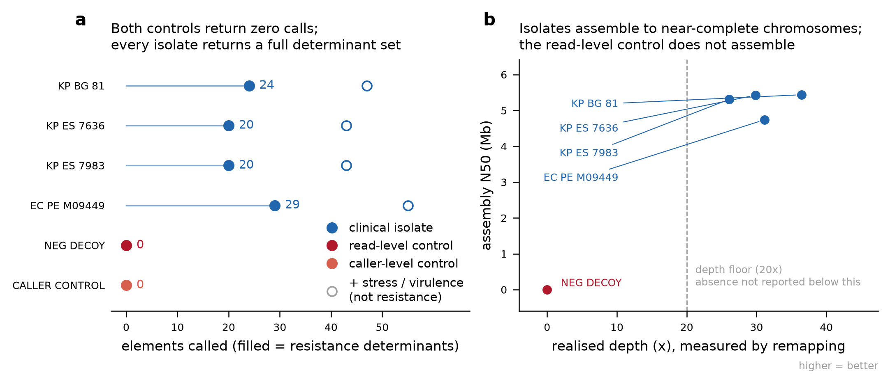
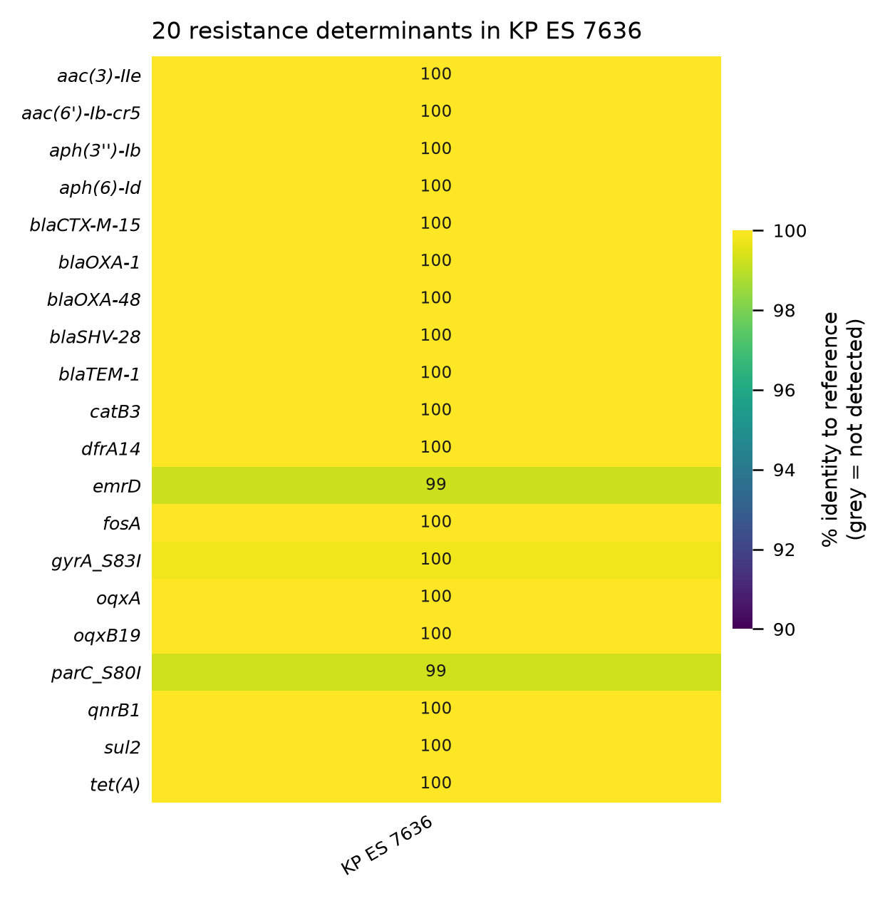
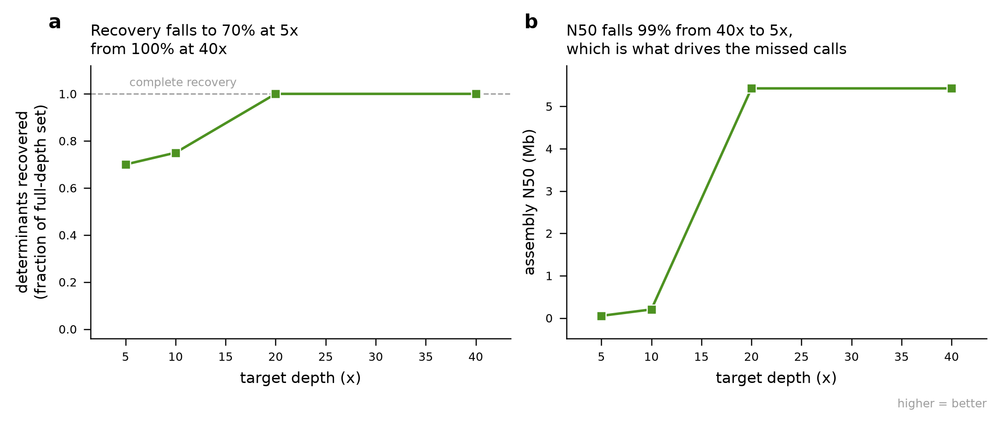
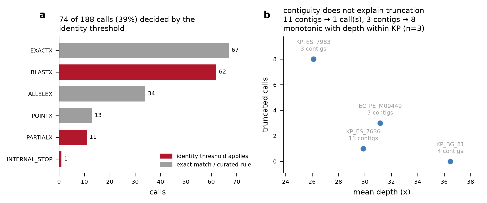

# ont-amr-nf

**Oxford Nanopore (R10.4.1) bacterial reads → validated antimicrobial-resistance gene calls.**

A Nextflow DSL2 pipeline that takes long-read sequencing data from clinical bacterial
isolates and produces resistance-gene calls **together with a verdict on whether those
calls are interpretable**. Run on real carbapenemase- and ESBL-producing clinical
isolates from public NCBI SRA data, with a synthetic negative control and a depth
titration that establishes where the method stops working.

---

## The problem this addresses

A resistance-gene caller will happily return a clean-looking table from a bad assembly.
Two failure modes matter clinically and neither raises an error:

1. **False negative from insufficient data.** Absence of `blaKPC` in a 6× assembly is not
   absence of `blaKPC`. Reported as "no carbapenemase detected", it is a wrong answer
   that looks like a right one.
2. **False positive from composition.** A caller matching on sequence composition rather
   than gene identity will report determinants on input that contains no genes at all.

So this pipeline does not just call genes. Every sample passes a **validation gate** that
can mark its result *uninterpretable*, and the run includes controls designed to make both
failure modes visible if they occur.

---

## Design decisions worth defending

**Depth is measured, not assumed.** Reads are remapped onto their own assembly with
minimap2 and depth comes from `samtools depth`. Estimating coverage as
`input_bases / expected_genome_size` is wrong twice over: reads removed by filtering are
still counted, and content that failed to assemble is counted as if it assembled.

**The negative control shares one code path with the real isolates.** `MAKE_DECOY`
shuffles the bases within each read of a real sample, preserving the read-length
distribution and per-read base composition and destroying only sequence order. It then
flows through the *identical* filter → assemble → call → gate path. A control processed
by different code proves nothing about the pipeline that processed the samples.

**There are two negative controls, because one is not enough.** The read-level decoy
does not assemble — correctly, that is what shuffled reads should do. But that means the
gene caller only ever receives an empty FASTA from it and returns an empty call set
trivially. That control tests the **assembler**; it says nothing about the **caller**.
So `SHUFFLE_ASSEMBLY` takes a real, good assembly and shuffles bases within each contig:
contig count, contig lengths and GC content are preserved exactly, gene content is
destroyed. The result goes through the same `AMRFINDERPLUS` process with the same
parameters. A call there is a call driven by composition rather than gene identity — a
false positive by construction — and the run summary says so in those terms.

**The decoy is run without `--organism`, deliberately.** No organism claim can be made
about shuffled sequence, and the goal is the most permissive call mode possible on it. If
anything survives there, it should be seen rather than filtered away.

**A failed assembly still emits a file.** `FLYE_ASSEMBLE` is not declared `optional`.
If it were, the decoy — which is *expected* to assemble poorly or not at all — would drop
out of the channel and its "negative control is empty" check would never execute. The
pipeline would then look clean precisely by omitting its own control. Instead a
zero-sequence FASTA plus a status file carries the failure forward to the gate.

**"No calls" is disambiguated.** The gate reads the assembly status alongside the call
set, because *no calls because nothing assembled* and *no calls in a good assembly* are
different findings that must not collapse into the same row.

**Role-specific expectations.** The isolates are known clinical carbapenemase/ESBL
producers, so zero calls on them indicates pipeline failure, not a susceptible isolate —
the gate asserts `positive_expectation_met`. For the decoy only `negative_control_is_empty`
is binding: a decoy that assembles badly has not failed, that is the point of it.

**Titration subsamples to a target depth, not a read count.** Read-length distributions
differ between isolates, so a fixed read count yields different coverage per sample and
the resulting curve would not be comparable.

---

## Quick start

```bash
# stub run — validates the whole DAG in seconds, no data or tools needed
nextflow run . -stub-run

# real run, tools resolved per process by conda
nextflow run . -profile conda

# real run against reads already on disk (stays offline)
nextflow run . -profile conda --reads_dir /path/to/fastq

# work directory on an external drive without symlink support (FAT32/exFAT)
nextflow run . -profile conda,portable_fs -work-dir /media/usb/work
```

Reads are fetched from SRA by accession if not found locally; every fetch is md5-recorded
in `results/reads/*.md5`.

**If the work directory is on a FAT32/exFAT volume, add `-profile portable_fs`.** Nextflow
stages process inputs as symlinks, which that filesystem cannot represent, and the run
dies with `ln: failed to create symbolic link: Operation not permitted` partway through —
not at launch, but at the first process that stages a file. `portable_fs` switches staging
to copy mode. This run hit it: the assemblies were developed on an ext4 volume and the
titration was later re-run from an external drive, where every task that had not already
been cached failed on the first symlink. Copy mode costs extra I/O on large FASTQs, which
is the reason it is not the default.

## Outputs

| File | Contents |
|---|---|
| `results/amr_calls.tsv` | every resistance determinant, per sample, with identity/coverage |
| `results/validation_summary.tsv` | PASS/FAIL per sample and per check, with the failing detail |
| `results/assembly_metrics.tsv` | contigs, N50, total length, GC, measured depth, breadth |
| `results/depth_titration.tsv` | determinants recovered vs. depth (when `--run_titration`) |
| `results/controls/` | control composition reports (source vs. shuffled) |
| `results/run_summary.md` | human-readable overview, including both control outcomes |
| `results/pipeline_info/` | execution report, trace, DAG, resolved tool versions |

## Key parameters

| Parameter | Default | Meaning |
|---|---|---|
| `--min_read_len` | 1000 | read length floor (bp) |
| `--min_read_q` | 10 | read quality floor |
| `--min_depth_x` | 20 | depth below which AMR *absence* is not reported |
| `--min_n50` | 50000 | assembly N50 floor for an interpretable result |
| `--amr_min_ident` | -1 | identity floor; `-1` keeps AMRFinderPlus's curated per-gene thresholds (see *Scope and limits*) |
| `--amr_min_cov` | 0.5 | AMRFinderPlus reference-coverage floor |
| `--make_decoy` | true | read-level control: shuffled reads through the full path |
| `--caller_control` | true | caller-level control: shuffled assembly, re-called |
| `--run_titration` | false | run the depth-titration experiment |

Every threshold that can change a result is a parameter — none are buried in a script.
`nextflow run . --help` lists them all.

## Pipeline steps

```
samplesheet
   ↓
FETCH_READS ──────── md5-recorded, local copy reused if present
   ↓
   ├─→ MAKE_DECOY ──────────── read-level control  (tests the assembler)
   ├─→ SUBSAMPLE_DEPTH ─────── depth titration points (optional)
   ↓
CALL_AMR  (one identical path for isolates, decoy and titration points)
   │
   ├─ NANOQ_FILTER ─────── length/quality filter
   ├─ FLYE_ASSEMBLE ────── --nano-hq (correct mode for R10.4.1 + SUP)
   ├─ ASSEMBLY_STATS ───── contiguity + depth measured by remapping
   ├─ AMRFINDERPLUS ────── organism-aware for isolates, permissive for controls
   └─ VALIDATION_GATE ──── PASS/FAIL + amr_result_interpretable
   │
   └─→ SHUFFLE_ASSEMBLY ──→ AMRFINDERPLUS ──→ CONTROL_GATE
                            caller-level control: same process, same
                            parameters; gated separately because it has
                            no reads, so no assembly check applies to it
   ↓
AGGREGATE_RESULTS ──── tables + run summary
```

## Data

Four real R10.4.1 clinical isolates, selected so that the sample set tests something:
a same-outbreak pair (call concordance), an independent lineage, and a second species
(organism-aware calling). Chemistry was confirmed from each submission's own kit and
basecaller fields rather than from a keyword match. Accessions, BioProjects, originating
studies and expected phenotypes are in
[`docs/data_provenance.md`](docs/data_provenance.md).

## Results on real data

Four public clinical isolates from three independent surveillance studies, plus both
controls. Full run: 4 assemblies + 2 controls on a 12-core laptop, no GPU.

| Sample | Role | Contigs | N50 | Total | GC | Depth | Breadth | AMR genes | Verdict |
|---|---|---|---|---|---|---|---|---|---|
| `KP_ES_7636` | test | 11 | 5,425,447 | 5,887,566 | 56.96% | 29.9x | 100% | 20 | PASS |
| `KP_ES_7983` | clonal replicate | 3 | 5,310,109 | 5,617,970 | 57.19% | 26.1x | 100% | 20 | PASS |
| `KP_BG_81` | independent lineage | 4 | 5,437,787 | 5,706,551 | 56.98% | 36.5x | 100% | 24 | PASS |
| `EC_PE_M09449` | cross-species | 7 | 4,740,491 | 5,115,139 | 50.65% | 31.2x | 100% | 29 | PASS |
| `NEG_DECOY` | read control | 0 | 0 | 0 | NA | 0x | 0% | **0** | PASS (expected failure) |
| `CALLER_CONTROL` | caller control | 11 | as source | 5,887,566 | 56.96% | n/a | **0** | PASS |

Depth is measured by remapping reads onto their own assembly, not estimated from input
yield. Breadth is the fraction of assembly covered at >=1x.

Every verdict in that column is a gate's output, reproducible from
`results/validation/`, not an authorial judgement. The two controls are gated
differently, because they are asking different questions. `NEG_DECOY` goes through
`VALIDATION_GATE` with the rest: it has reads, so assembly quality applies to it, and the
gate inverts its expectation — it must return zero elements. `CALLER_CONTROL` has no reads
at all (it is a real assembly with its bases shuffled), so depth, N50 and breadth do not
exist for it and it goes through `CONTROL_GATE` instead, which carries one binding check:
zero elements of any class. Its assembly-quality fields are published as `NA` rather than
`0`, since `0` would read as a measurement. `n/a` in the depth column above means the same
thing.



*Figure 1 — assembly quality and control behaviour across the run. Controls carry their own
hue throughout every figure: the read-level decoy and the caller-level control are never
styled as isolates. Rendered by `bin/make_figures.py`.*

**"AMR genes" means resistance determinants only.** AMRFinderPlus returns three classes
of element in one table — `AMR` (acquired and mutational resistance determinants),
`STRESS` (biocide, metal and heat tolerance) and `VIRULENCE` — and counting all of them
together roughly doubles the apparent number of resistance genes. `KP_ES_7636` returns 43
elements, of which 20 are resistance determinants and 23 are stress-tolerance genes. Both
numbers are published (`amr_calls` and `total_elements` in `validation_summary.tsv`), and
the distinction is load-bearing for the gate: `positive_expectation_met` counts resistance
determinants, so an isolate whose resistance calling silently failed cannot satisfy it on
the strength of its metal-tolerance genes. The negative-control check runs the other way
and requires zero elements of *any* class — a control must return nothing at all, not
merely nothing under one label.

### The four things this run actually demonstrates

**1. Clonal concordance — 1.0000.** `KP_ES_7636` and `KP_ES_7983` are two isolates of the
same ST5994 outbreak clone, sequenced separately and assembled independently here. They
returned **identical** determinant sets: 20 genes each, 20 shared, zero discordant
(Jaccard = 1.0000). Nothing in the pipeline enforces this — the two samples never meet.
It is the closest thing available to a reproducibility measurement on real data.



*Figure 2 — resistance determinants by isolate. 52 distinct genes across the four isolates;
exactly one (`parC_S80I`) is shared by all four. The title is computed from the plotted
rows, not written by hand.*

**2. Expected phenotypes recovered, including co-production.** Each source study describes
its isolates independently of this pipeline, which makes those descriptions *a priori*
expectations rather than post-hoc agreement:

| Sample | Study describes | Recovered here |
|---|---|---|
| `KP_ES_7636` / `KP_ES_7983` | carbapenemase-producing K. pneumoniae ST5994 | `blaOXA-48`, `blaCTX-M-15`, `blaOXA-1` |
| `KP_BG_81` | carbapenem-resistant Enterobacterales surveillance | `blaNDM-5`, `blaSFO-1`, `ompK36_D135DGD` |
| `EC_PE_M09449` | carbapenemase **co-producing** E. coli | `blaOXA-48` **and** `blaNDM-1`, plus `blaCTX-M-15`, `blaOXA-1` |

The Peru isolate is the sharpest of these: the study claims co-production of two
carbapenemases, and both were recovered in the same genome. `KP_BG_81` carries a
different carbapenemase family (`blaNDM-5`) from a different country, so the result is
not an artefact of one lineage.

**3. Both negative controls came back empty — and they test different things.** The
read-level decoy did not assemble, which is correct for shuffled reads. The caller-level
control did assemble (by construction: it *is* a real assembly with bases shuffled within
each contig) and was re-called with identical parameters, returning zero determinants. Its
published composition table shows contig count, contig lengths, total length and base
fractions matching the source assembly to six decimal places — so the empty result cannot
be explained by having handed the caller something trivially different.

```
metric        source      shuffled
contigs       11          11
total_bp      5,887,566   5,887,566
gc_fraction   0.569597    0.569597
```



*Figure 3 — depth titration. Recovery against subsampled depth, which is where the 20x
floor comes from: it is read off this curve rather than taken from a guideline.*

**4. The 20x depth floor is measured, not asserted.** The gate refuses to report absence
below 20x, and that threshold would be an arbitrary number if nothing tested it.
`--run_titration` subsamples one isolate (`KP_ES_7636`, 29.9x) to 5x, 10x, 20x and 40x and
re-runs the identical calling path on each:

| Target | Realised | N50 | Determinants | Recovery | Missed |
|---|---|---|---|---|---|
| 5x | 4.71x | 53,206 | 17 / 20 | 0.7000 | `blaOXA-1`, `blaTEM-1`, `emrD`, `gyrA_S83I`, `oqxA`, `oqxB19` |
| 10x | 8.42x | 203,873 | 18 / 20 | 0.7500 | `blaCTX-M-15`, `oqxB19`, `parC_S80I`, `qnrB1`, `tet(A)` |
| 20x | 16.90x | 5,425,465 | 20 / 20 | 1.0000 | — |
| 40x | 29.88x | 5,425,446 | 20 / 20 | 1.0000 | — |

Recovery is complete at 20x and above and degrades below it — 75% at 10x, 70% at 5x. The
mechanism is visible in the N50 column: contiguity collapses by two orders of magnitude
(5.4 Mb → 53 kb) before recovery starts to fall, which is what a short-contig assembly
does to a caller that needs a gene-length alignment. The determinants lost at 10x include
`blaCTX-M-15` and `parC_S80I` — an ESBL and a fluoroquinolone-resistance mutation, both
clinically actionable — so this is not a matter of losing marginal hits. That is the
argument for the floor: below it, a report of "absent" is a statement about depth, not
about the genome.

Recovery is measured over resistance determinants only (20 at full depth), not over all
43 elements. Counting `STRESS` elements in as well reported 0.8837 at 10x instead of
0.7500 — the aggregator did exactly that until `tests/test_aggregate.py` pinned it. The
stress-tolerance genes are numerous and largely depth-insensitive in this sample, so
including them dilutes the loss of the calls the pipeline exists to report. The inflated
number is also the flattering one, which is the direction an unchecked metric tends to
drift.

Two further details are visible in the call sets and worth knowing before reading any
low-depth AMR result. First, the losses are partly *allele* losses rather than gene
losses: at 10x the caller reports `blaCTX-M` and `qnrB` where full depth resolves
`blaCTX-M-15` and `qnrB1`. The gene is detected; the allele is not, because the
distinguishing bases are not covered confidently enough. For a beta-lactamase family
where alleles differ in spectrum, "`blaCTX-M` present" is a materially weaker statement
than the full-depth call. The 5x `blaTEM` call is weaker still: 53.85% coverage of the
reference, i.e. the gene is split across a contig boundary. Second, low depth produces
calls that are *absent* at full
depth: `ompK36_L184FfsTer14` at 5x and `nfsB_E175RfsTer2` at 10x are both frameshift
calls on fragmented assemblies, which is how assembly error looks to a point-mutation
caller. So a low-depth run does not simply return a subset of the truth — it returns a
different set, in both directions.

Note the 40x row realises 29.88x, not 40x: the input only contains 29.9x, so the request
saturates. The pipeline records what was realised by remapping rather than what was asked
for, which is why the two highest rows are near-duplicates instead of a clean 2x step.

### Reading the negative control's PASS

`NEG_DECOY` shows `PASS` with `failed_checks = assembly_produced;depth;n50;genome_size;breadth`.
That is not a contradiction. For a sample whose role is `negative_control`, the verdict is
defined by whether the control *behaved as a control should* — zero calls — and the quality
checks are recorded as failed because they genuinely failed. A negative control that
passed the assembly-quality checks would be the alarming outcome.

## Tests

```bash
python3 tests/run_all.py example_results/results_main     # every suite, one summary
```

`example_results/` is the output of the two runs described below — the summary tables,
per-sample AMRFinderPlus calls and per-sample verdicts, 188 KB in total. It is committed
on purpose: the tests check the gates and the figure script against real published output,
so cloning the repository is enough to run all 36 checks and re-render all three figures
without installing a single tool. Assemblies and alignments are not shipped.

Or individually:

```bash
python3 tests/test_validation_gate.py results/
python3 tests/test_control_gate.py results/
python3 tests/test_figures.py results/
python3 tests/test_aggregate.py
python3 tests/test_samplesheet.py          # needs a working nextflow
python3 tests/test_module_paths.py
```

`run_all.py` refuses an empty or wrong results directory rather than reporting success
over nothing, reports which suites skipped and why, and warns if a suite exists on disk
but is not in its list — a new suite that nobody runs is not a test.

The suites are **mutation tests**: each one breaks something in a specific, plausible way
and asserts that the code refuses to produce output. This is deliberate. The gates and the
figure script carry self-checks, and a self-check that cannot fail is worse than no check
at all — it reads as evidence while proving nothing. Several checks in this repository
were exactly that until these tests were written:

- The gate's `positive_expectation_met` counted every element AMRFinderPlus returned, so
  an isolate with zero resistance determinants and twenty metal-tolerance genes satisfied
  a check whose stated purpose is to prove the resistance caller works.
- The figure script's leader-line check asserted that each label's leader ended on *a*
  marker rather than on *its own* marker. Every possible mis-pairing of labels to points
  passes that check, including one that labels every isolate with its neighbour's name.
- The figure script's geometry check — no overlapping text, nothing off the canvas —
  printed its findings and returned. It detected a real violation in figure 3 and the
  script still wrote the figure and exited 0, so the run read as clean. It now raises.
  Switching it on immediately surfaced three further defects it had been hiding: it was
  counting tick labels outside the axis view interval, which matplotlib never draws; a
  hardcoded figure-2 title claimed genes were "shared" on a single-sample panel; and
  both controls were labelled at the same fixed offset, so a run in which both behaved
  correctly — identical zero coordinates — stacked the two labels on top of each other.
  The healthy run was the unreadable one.
- The caller-level control — the sharpest control here — had no check at all. Its calls
  went straight to the aggregator, and "the control came back empty" was a sentence in
  this README rather than an assertion in the code. Had the shuffle silently stopped
  shuffling, every isolate's determinants would have been reproduced on the control and
  the run would still have reported success.
- Nothing reconciled the published files against each other. Fixing the element-counting
  bug above fixed the *code*, but the verdicts already on disk had been written by the
  old gate, and the aggregator copied their numbers forward without complaint. The
  shipped result was three files disagreeing three ways about the same isolate:
  `validation_summary.tsv` said `amr_calls=55`, `run_summary.md` said 26, and the call
  table held 29 AMR rows out of 55 elements — with the new `total_elements` column
  reading `NA`, since the old verdicts predated it. No stage errored; every number was
  the faithful product of the stage that produced it. Every other check in this suite
  builds its own fixtures, which is precisely why none of them could see a stale input.
  `check_published_counts_agree` reads what is actually shipped and recomputes each
  count from the call table.
- The two documented render commands fought each other. Figure 3 needs the titration
  table, which the main run does not produce, so this README tells you to run
  `make_figures.py` twice into the same figure directory. Every figure function ran
  unconditionally, so the second command re-derived figures 1 and 2 from the titration
  directory — one full-depth isolate and its subsamples, no controls — and wrote them
  over the real six-sample versions under the same filenames. Both runs printed
  success and both self-checks passed, because the figures were geometrically perfect
  renderings of the wrong data. The committed figures were wrong when I noticed.
  Figures 1 and 2 now decline a titration directory the way figure 3 already declined
  a directory with no titration table. The guard is deliberately narrower than "has no
  controls": `--make_decoy false --caller_control false` is a legitimate run, and there
  the missing controls must be visible in the figure rather than hidden by its absence.
- A comment that used to be true drew the caller-level control twice. It originally had
  no validation row — it bypasses the assembly gate by design, being an assembly
  already — so figure 1 appended it from the presence of its call table, with a comment
  saying exactly that. Giving it a validation row (two entries above) made the comment
  false and the append a duplicate: the control was drawn twice and counted twice, and
  panel a announced "All 3 controls return zero calls" over two controls. The figure
  self-checks passed throughout, because two identical rows overlap no worse than two
  different ones. It is now appended only if the summary does not already carry it.
  `control_titles_match_data` could not have caught this: its fixture wrote only the
  `.tsv` files, so `amr/CALLER_CONTROL.amrfinder.tsv` never existed in the scratch
  directory and the appending branch was unreachable under test. The fixture now writes
  that file, and the check reads the sample rows off the figure being saved and
  requires each sample to appear exactly once. Removing the fixture's `amr/` directory
  makes the check blind again, which is what makes it worth having.
- Two of the published numbers are genuinely different quantities with near-identical
  names, and I misread my own output because of it. `run_summary.md`'s "AMR genes"
  counts distinct gene symbols; `validation_summary.tsv`'s `amr_calls` counts called
  rows; figure 1's axis says "elements called". They diverge whenever one gene is
  called on two contigs — `EC_PE_M09449` is 26 symbols and 29 rows — so all three are
  right and none of them is a defect. Nothing was broken here, but the consistency
  check had pinned only two of the three files, leaving the loosest one free to drift
  into the other's definition. It now checks each number against its own definition,
  and swapping the row count in for the symbol count fails it.
- I audited that exact conflation and shipped it anyway, three lines higher up the same
  file. `run_summary.md` headlined "total AMR determinant calls: **188**" — every
  element row, 93 AMR plus 87 metal-tolerance plus 8 virulence — while I was pinning
  the per-sample column directly beneath it and concluding there was no defect. The
  aggregator's variable was called `amr_rows` and held all of them, so the name read
  true at the call site. It is `element_rows` now, the headline reports the two
  quantities separately (93 determinants, 95 other elements), and the consistency check
  pins both headline numbers as well as the per-sample column — including a check that
  the old label does not come back. Reviewing one number in a file is not reviewing the
  file; the header is where a reader's eye lands first, and it was the wrong number.
- The caller ran with its curated identity thresholds switched off, for the whole run
  history, because the config set `amr_min_ident = 0.9` — which looks like the tool's
  own default and is not the same thing. AMRFinderPlus documents `-1` as "use a curated
  threshold if it exists and 0.9 otherwise", and `amrfinder.cpp` forwards the flag to
  the reporting engine only when the value is not `-1`:
  `(ident == -1 ? noString : "  -ident_min " + toString (ident))`. So passing `0.9`
  does not restate the default — it replaces every gene's curated cutoff with one flat
  number across the database. Those per-gene cutoffs are what separate closely-related
  alleles, and 74 of the 188 published calls (39%) are BLAST- or PARTIAL-method hits
  governed by this threshold, among them `blaOXA`, `tet(A)`, `sul2`, `mph(A)` and
  `erm(B)`. I first read the one bare `blaOXA` call as evidence of the loosened
  threshold, and it is not: the same run resolves `blaOXA-48`, `blaOXA-1` and
  `blaOXA-9` by exact allele match, and the bare call is `INTERNAL_STOP` at 61.23%
  coverage — a truncated gene, which is the separate assembly-error finding below.
  The verification step that pins the numbers in this paragraph is what caught that,
  which is the argument for pinning them. Nothing in the run announced the threshold:
  the flat threshold is more permissive than most curated ones, so it costs calls
  nowhere and only loosens allele-level precision. `--ident_min` is now emitted only
  when the user asks for a non-default floor, the shipped default is `-1`, and three
  checks in `test_module_paths.py` cover the flag construction, the config default and
  the guard's behaviour. Restoring the hardcoded flag fails the first; restoring `0.9`
  fails the second. The published results in `example_results/` predate this fix and
  were produced with the flat threshold.

`test_validation_gate.py` and `test_control_gate.py` extract the Nextflow-interpolated
Python from their modules and substitute the interpolations, so they exercise the source
the pipeline actually runs rather than a copy that can drift from it. They use the
published call tables for the real-data cases and synthetic tables for the cases a healthy
run does not contain: an isolate with stress hits but no resistance genes, a contaminated
negative control, and a caller control contaminated with each element class in turn.

`test_control_gate.py` also covers what the control's verdict does downstream. Because the
control has no reads, its depth and N50 are **null rather than zero** — zero would read as
a measured value — and the aggregator must render that without crashing. The test runs the
real aggregator over a null-depth verdict, then re-runs it with the guard removed to
confirm the check is not vacuous; the unguarded version raises `TypeError` on `None`.
That failure would land in the last process of the run, after every assembly and every AMR
call had already been computed.

`test_samplesheet.py` drives the real workflow with malformed samplesheets, because the
validation lives in Groovy inside the workflow and the thing worth testing is whether the
run actually refuses. It covers an empty `sample_id` (which previously produced publish
files named `.verdict.json` and `.amrfinder.tsv` — dotfiles, invisible to `ls`, while the
run still reported `completed : OK`), a mistyped role such as `negatve_control` (which
would route the decoy to the positive-expectation branch, scoring the one sample that must
come back empty as though it had to come back full), a duplicate id, and an id that is not
filename-safe. `test_figures.py` re-renders the real figure and then mutates the plotting
source three ways: mislabelled leaders, a dropped label, and an unknown samplesheet role.
It also renders the titration figure against three shapes of synthetic data — complete
recovery, collapse at low depth, and high-but-imperfect — and checks each panel title
against the numbers it was given, because both titles were originally hard-coded
conclusions written before the titration had produced any data.

That suite is also the source of the sharpest lesson in this repo. It reported
`all 4 checks passed` while pointed at a directory containing none of the pipeline's
tables: `make_figures.py` returns early when its input tables are absent, so the baseline
"rendered clean" without drawing anything and every mutation "rendered without complaint"
because the mutated code never ran. Four green checks over a figure that did not exist.
It now refuses to start unless the tables it needs are present, and the baseline asserts a
figure file was written rather than only that nothing raised — a skipped figure raises
nothing either. The same shape of bug is worth looking for in any test suite whose subject
can silently do nothing.

A related failure sits on the other side of the same problem. `test_samplesheet.py` gated
itself on `shutil.which("nextflow")`, but the `nextflow` command is a launcher script that
downloads its runtime on first use. On a machine with no route to that download, the
command is on `PATH` and fails every invocation — so the guard passed, every subsequent
check found "no complaint emitted", and a missing tool was reported as five defects in the
samplesheet validation. It now probes by running `nextflow -version` and skips with the
reason attached. A tool check should ask whether the tool *works*, not whether a file with
the right name exists, and a skip should always say why: a suite that silently stops
testing anything looks exactly like a suite that passes.

## Scope and limits

- **Basecalling is not performed here.** The public input is already basecalled with
  dorado SUP. Raw-signal basecalling needs a GPU and the POD5 signal data; the pipeline
  documents the chemistry and basecaller of its inputs rather than re-deriving them.
- **Resistance genotype is not resistance phenotype.** A detected determinant is not an
  MIC. Expected phenotypes in the provenance doc come from the originating studies and
  are used here as positive-control priors, not as validated susceptibility results.


*Figure 4 — (a) which calls the identity threshold decides: BLAST-derived hits, including
their PARTIAL and INTERNAL_STOP variants, versus calls settled by exact match or a curated
mutation rule. (b) truncated calls against measured depth. Both panels derive their titles
from the plotted rows: panel b asserts a depth ordering only when the points show one, and
says so otherwise. Rendered by `bin/make_figures.py` from the published tables.*

- **Assemblies are not polished.** Reads go filter → flye → caller with no medaka or
  racon step. Flye's own two iterations are the only correction applied. The cost is
  visible in the published calls: 12 of 188 are `PARTIALX` or `INTERNAL_STOP`, which is
  how a residual indel looks to a protein-level caller — a frameshift, then a truncated
  or prematurely stopped alignment. It is not an assembly-contiguity problem, which was
  the first thing I checked, and the ranking runs the wrong way: `KP_ES_7636` is the
  most fragmented isolate (11 contigs) and carries 1 truncated call, while `KP_ES_7983`
  is the least fragmented (3 contigs) and carries 8. Within Klebsiella the count tracks
  depth instead — 8 at 26.1x, 1 at 29.9x, 0 at 36.5x. (`KP_BG_81` holds the highest N50
  at 5.44 Mb; `KP_ES_7983` has the fewest contigs but not the longest.) Adding a
  polishing step is the single highest-value change to the calling path; it is not here
  because medaka's models are basecaller- and chemistry-specific, and pinning one
  correctly matters more than adding one quickly.
- **`recovery_fraction` counts a truncated gene as recovered.** It compares gene symbols,
  so a `PARTIALX` hit at 61% reference coverage scores the same as a full-length exact
  match. Recomputing it over intact calls only moves the two low-depth rows — 0.75 → 0.74
  at 10x and 0.70 → 0.63 at 5x — because at 5x `aph(6)-Id` and `dfrA14` are recovered
  only as fragments while both are intact at full depth. The published metric is the
  looser of the two, and it is reported as-is rather than silently tightened, because
  the titration's question is "is the determinant still detectable", not "is it intact".
  Read it as detection, not as reconstruction.
- **Not a diagnostic device.** This is a reproducible research pipeline. Clinical use
  requires validation, accreditation and controls far beyond its scope.

## Citations

Tool and reference-database citations: [`CITATIONS.md`](CITATIONS.md).

## License

MIT — see [`LICENSE`](LICENSE).
